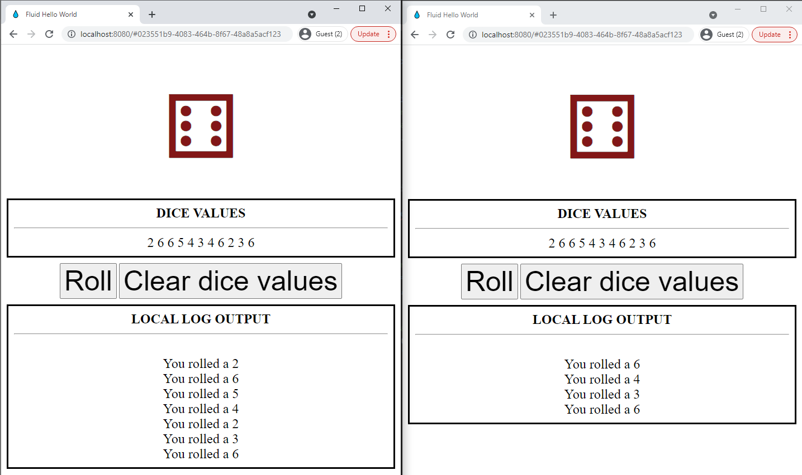
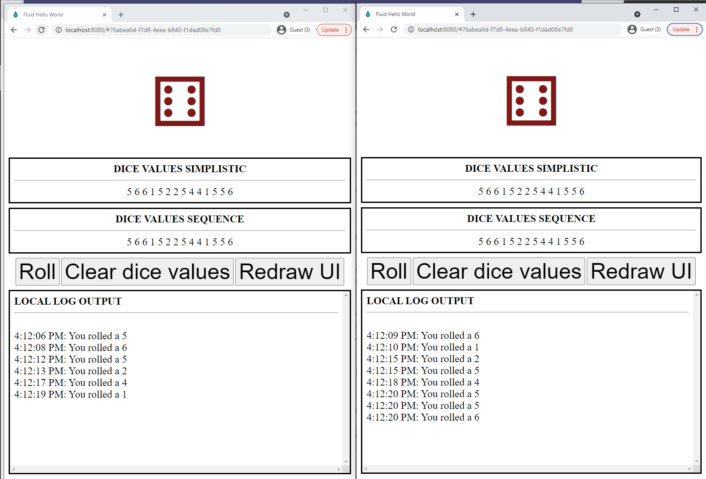

# @fluid-example/hello-world

This repository is based on the simple app example [FluidHelloWorld](https://github.com/microsoft/FluidHelloWorld)
of Microsoft that enables all connected clients to roll a dice and view the result. 

For a
walkthrough of this example and how it works, check out the [tutorial documentation](https://aka.ms/fluid/tutorial).

The purpose of this fork is to experiment with recording and sharing the sequence of dice values over all connected clients.

## Naive simplistic implementation


The first naive simplistic implementation is by recording the array of dice values as a key-value in the `diceMap` of type `SharedMap` with the key `dice-values-key`. But every client who rolls the dice will execute the steps:

1. Retrieve the dice values
2. Append the new value
3. Save the updates set of dice values

If two customers do this at the same time the latest will win and overwrite the value of the other user.

Note that changes on a `SharedMap` can be detected through a watch on `valueChanged`:

```javascript 
container.initialObjects.diceSequence.on("valueChanged", (e) => {
    updateDice();
});
```

This version is available in the branch https://github.com/svdoever/FluidHelloWorld/tree/feature/simplistic-sequence

## Sequence implementation



The second implementation records the dice values in the `diceSequence` of type `SharedNumberSequence`:

```javascript
const containerSchema = {
    initialObjects: {
        diceMap: SharedMap,
        diceSequence: SharedNumberSequence,
    },
};
```

To initialize this field with an empty sequence do the following:

```javascript
if (!container.initialObjects.diceSequence) {
        log("Initial creation of dice sequence");
        try {
          container.initialObjects.diceSequence = SharedNumberSequence.create(
              container.runtime,
              "dice-sequence"
          );
        } catch (e) {
            log(`Error creating dice sequence: ${e}`);
        }
    }
}
```

And to add a number value to the sequence do:
```javascript
const diceValuesCount = container.initialObjects.diceSequence.getItemCount();
container.initialObjects.diceSequence.insert(diceValuesCount, [value]);
```
Note that changes on a `SharedNumberSequence` and other sequences can be detected through a watch on `sequenceDelta`. See [here](https://github.com/microsoft/FluidFramework/blob/bd0079be2ec9553c8dbe0b1b89b898e789cb66c8/packages/dds/sequence/src/sequence.ts#L70) for more information.

This version is available in the branch https://github.com/svdoever/FluidHelloWorld/tree/feature/correct-sequence
## Requirements

Node 12.17+

## Getting Started

After cloning the repository, install dependencies and start the application

```bash
npm install
npm start
```